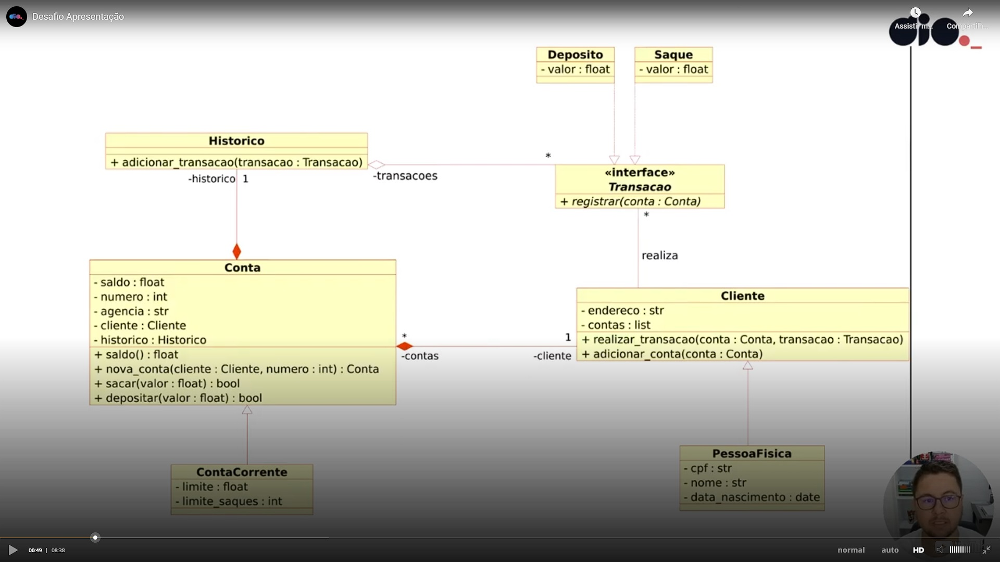

<h1>
    
     Otimizando um sistema bancário 
</h1>

## Objetivo 🎯
Iniciar modelagem do sistema bancário em POO. Adicionar classes para os clientes e operações bancárias: saque e depósito

## Desafio
Atualizar a implementação do sistema bancário, par armazenar os dados de clientes e contas bancárias em objetos ao invés de dicionários. O código deve segur o modelo de classes  

</a>

